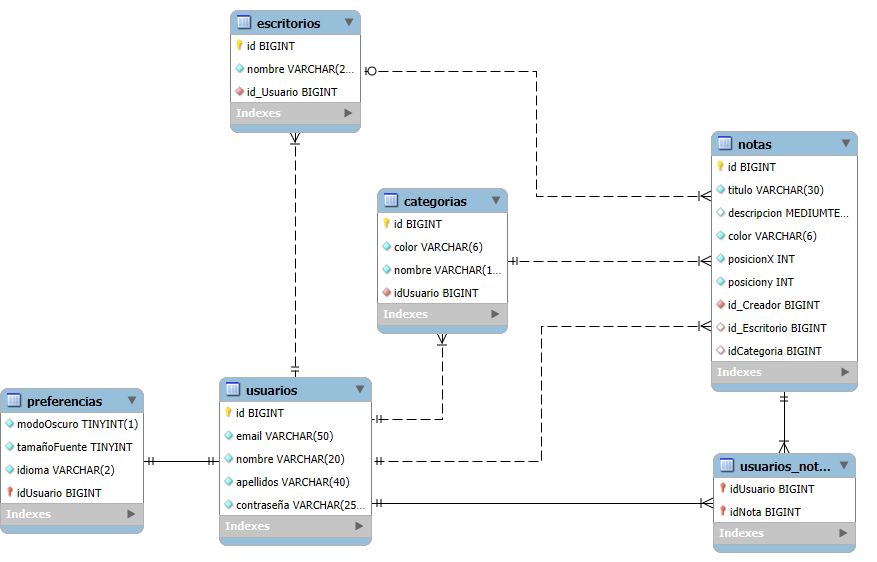
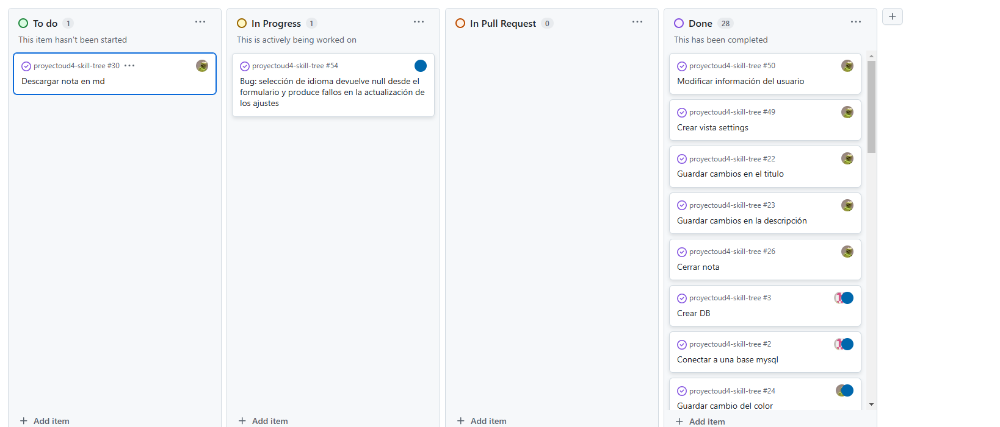

[](https://classroom.github.com/a/0a0_p58R)
[](https://classroom.github.com/online_ide?assignment_repo_id=18039946&assignment_repo_type=AssignmentRepo)

# Aplicación SpriNotes

Esta aplicación fue creada como un trabajo para la asignatura de Acceso a datos donde se busca reflejar lo aprendido sobre SpringBoot.
La aplicación permite al usuario registrarte y acceder a un área personal donde crear escritorios y notas, que aparecerán en forma de posits.
De esta forma la aplicación permite la organización de las notas mediante los escritorios y las categorías asignadas a las notas.

___
# Índice

1. [Diagrama ER de la BD en Notación Crow's Foot Model de BD](#diagrama-er-de-la-bd-en-notación-crows-foot)
1. [Manual técnico para desarrolladores](#manual-técnico-para-desarrolladores) <br>
   2.1. [Requisitos](#requisitos)<br>
   2.2. [Ejecución](#ejecución)<br>
   2.3. [Estructura de la aplicación](#estructura-de-la-aplicación)<br>
   2.4. [Código destacable](#código-destacable)
2. [Manual de usuario](#manual-de-usuario)
1. [Explicación de GitProject](#explicación-de-gitproject)
1. [Propuestas de mejora](#propuestas-de-mejora)
1. [Conclusiones y opinión del trabajo realizado](#conclusiones-y-opinión-del-trabajo-realizado)
___
## Diagrama ER de la BD en Notación Crow's Foot
En la siguiente imagen podemos ver el diagrama Entidad Relación de nuestra base de datos.
Los usuarios pueden tener uno o muchos escritorios, que al mismo tiempo pueden contener ninguna o muchas notas (creadas por un único usuario). Estas notas deben pertenecer a una categoría y pueden ser compartidas con multiples usuarios. 
Por último cada usuario tiene unas preferencias, que referencian a las características de la aplicación.


[⬆️Volver al índice](#índice)
___
## Manual técnico para desarrolladores
En esta parte abordaremos los aspectos técnicos de este proyecto, para ello incluimos algún ejemplo de código fuente que consideramos interesante y su explicación.

### Requisitos

Necesitas tener instalado en tu sistema:

- Java 17
- Maven: Se utiliza Maven para la gestión de dependencias.
- MySQL (Si quieres trabajar en local): La aplicación utiliza una base de datos MySQL, el archivo de creación está incluido dentro del  en caso de que quieras usarla sin conexión.

### Ejecución

Puedes ejecutar la aplicación usando el _goal_ `run` del _plugin_ Maven
de Spring Boot:

```
$ ./mvnw spring-boot:run 
```   

También puedes generar un `jar` y ejecutarlo:

```
$ ./mvnw package
$ java -jar target/mads-todolist-inicial-0.0.1-SNAPSHOT.jar 
```

Una vez lanzada la aplicación puedes abrir un navegador y probar la página de inicio:

- [http://localhost:8080/login](http://localhost:8080/login)

### Estructura de la aplicación

Esta aplicación se ha creado siguiendo los modelos de diseño MVC y DAO, por lo que podemos dividir su estructura en:
- **Authentication:** Paquete responsable de la seguridad y autentificación de los usuarios.
- **Config:** Contiene código relacionado con la configuración de la aplicación.
- **Controller:** Es la capa de entrada de la aplicación, donde se reciben las solicitude HTTP.
- **DTO:** Las clases de este paquete permiten transmitir información entre capas.
- **Model:** Representa las entidades de la base de datos.
- **Repository:** Paquete encargado de acceder a la base de datos mediante JPA.
- **Service:** Aquí se contiene la lógica de negocio. Llama a las clases de **Repository** para obtener datos y los manipula antes de enviarlos a la capa **Controller**.
- **Resources:** Almacena archivos estáticos y templates.

Esta arquitectura por capas permite a la aplicación una separación clara de responsabilidades, mejorando la escalabilidad, el mantenimiento y la reutilización del código.
El flujo de interacción entre capas sigue un enfoque estructurado:

1. El Cliente envía una solicitud al Controller al acceder a un url, que como punto de entrada.
1. El Controller delega la lógica de negocio a la capa Service, asegurando que las reglas de negocio se apliquen correctamente.
1. La capa Service interactúa con Repository, que puede consultar o actualizar la Base de Datos a través del Model.
1. La respuesta fluye de regreso en el mismo orden, transformando los datos si es necesario mediante DTOs, hasta que el Controller envía la respuesta al cliente.

### Código destacable

[⬆️Volver al índice](#índice)
___
## Manual de usuario

Para mostrar como funciona la aplicación desde el punto de vista del usuario hemos creado el siguiente videotutorial:


[⬆️Volver al índice](#índice)
___
## Explicación de GitProject
Para la organización del proyecto se usó una de las herramientas ofrecidas por GitHub para crear un tablero de estados.
La primera fase de este trabajo fue establecer dentro de este las tareas (cada una creada con un issue) y asignarlas a los diferentes miembros del equipo.
De esta forma se puede resumir de forma rápida y visual la carga de trabajo para cada miembro, la cantidad de trabajo general y su estado de completación.



En el siguiente enlace se pueden consultar todas las issues creadas y su asignación:
https://github.com/CGAInstitution/proyectoud4-skill-tree/issues?q=is%3Aissue%20


En cuanto al manejo del repositorio se usó la metodología GitFlow. Se generaron ramas para las distintas funcionalidades, que una vez terminadas se asimilaban a la rama Develop mediante Pull Requests.
El uso de las Pull Request permitió al equipo un mejor control sobre el avance de la aplicación, pudiendo revisar el código y prevenir errores.

[⬆️Volver al índice](#índice)
___
## Propuestas de mejora
- **Añadir opciones de idioma**: Nos gustaría que el usuario pueda cambiar su preferencia de idioma en settings y poder cambiar acorde los textos de la aplicación.
- **Añadir un modo oscuro**
- **Opción de compartir escritorios**
- **Diferentes modos de compartir:** Dar al usuario la opción de compartir notas con permisos de vista o de editor.
- **Añadir notas que te han compartido a tus escritorios**
- **Hacer la web responsive**
- **Añadir la funcionalidad de las categorías a las notas**

[⬆️Volver al índice](#índice)
___
## Conclusiones y opinión del trabajo realizado

Con este trabajo hemos aprendido mucho sobre SpringBoot y las aplicaciones web, repasando conocimientos anteriores de frontend y juntándolo con lo aprendido en esta asignatura consultas y tratamiento de datos en el backend.
Por ejemplo hemos realizado peticiones desde el frontend a la API de la aplicación, y hemos utilizado capas de service y repository (que cubren las consultas básicas a sql), y con dtos. Sentimos que los conocimientos se han asentado y hemos logrado un nuevo nivel de entendimiento.
No tuvimos todo el tiempo que nos gustaría para dedicarle al proyecto, por lo que ciertos ajustes finales en cuanto a la interfaz y las funcionalidades han tenido que cortarse.

Contamos que de media le hemos dedicado unas 25 horas al proyecto. Esperamos una calificación de 8 o 8,5, ya que hemos cumplidocon los requisitos del proyecto y hemos realizado varios extras:
- Comprobación de formularios
- Creación de un frontend con Vue (notas editables)


